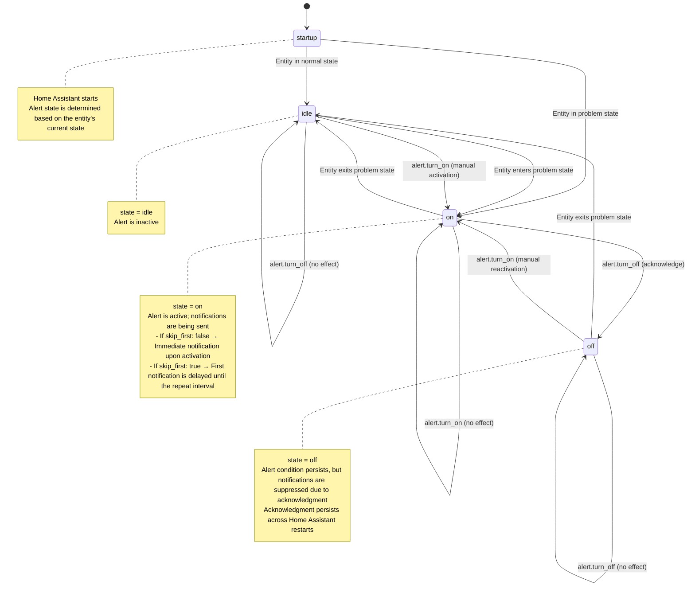

# Hass Alerting

## 1. NotiScript

- <https://www.home-assistant.io/integrations/alert/>
- <https://github.com/redstone99/hass-alert2/>
- <https://github.com/sejnub/ha-notiscript>

## 2. My API

script.change_alert(alert_id, operation): result

| Service    | Meaning                               |
| ---------- | ------------------------------------- |
| activate   | Turns on  a single or multiple alerts |
| deactivate | Turns off a single or multiple alerts |
|            |                                       |
| ack        | acks   a single or multiple alert     |
| unack      | unacks a single or multiple alert     |
|            |                                       |

### 2.1. My implementation with alert integration

- each alert `alert.klaus` gets one `input_boolean.alert_klaus`

- script.change_alert(klaus, activate)   -> call `input_boolean.turn_on`  on the target `input_boolean.alert_klaus`
- script.change_alert(klaus, deactivate) -> call `input_boolean.turn_off` on the target `input_boolean.alert_klaus`

- script.change_alert(klaus, ack)        -> call `alert.turn_off`         on the target `alert.klaus`
- script.change_alert(klaus, unack)      -> call `alert.turn_on`          on the target `alert.klaus`


## 4. Alert Integration

### 4.1. Zustandsdiagramm



### 4.2. Eigenschaften der Alert-Entität

State ()

| Eigenschaft              | Beschreibung                             | Beispiel                     |
| ------------------------ | ---------------------------------------- | ---------------------------- |
| `state`                  | Aktueller Zustand der Alert-Entität      | `idle`, `on`, `acknowledged` |
| Attribut `friendly_name` | Anzeigename der Entität                  | "Wassersensor ausgelöst"     |
| Attribut `message`       | Text der Benachrichtigung                | "Wasser unter der Spüle!"    |
| Attribut `title`         | Titel der Nachricht (optional)           | "Achtung"                    |
| Attribut `done_message`  | Nachricht, wenn entity wieder "off" wird | "Alles trocken"              |
| Attribut `repeat`        | Liste von Intervallen in Minuten         | `[10, 30, 60]`               |
| Attribut `acknowledged`  | Gibt an, ob quittiert wurde              | `false`                      | `true` |
|                          |                                          |                              |

### 5.1. Beispiel-Konfiguration (configuration.yaml)

```yaml
alert:
  wasser_leck:
    name: Wassersensor ausgelöst
    entity_id: binary_sensor.wasser_unter_spuele
    state: "on"
    repeat: [10, 30]
    skip_first: false
    notifiers:
      - mobile_app_mein_telefon
    title: "Achtung!"
    message: "Wasser unter der Spüle erkannt!"
    done_message: "Alles trocken."
    acknowledge: true
```

### 5.2. UI-Button zum Quittieren (Lovelace)

```yaml
type: button
name: Alert quittieren
icon: mdi:check
tap_action:
  action: call-service
  service: alert.dismiss
  target:
    entity_id: alert.wasser_leck
```

## 3. Alert2 Integration

| Service                     | Meaning                                                                                                                                                                       |
| --------------------------- | ----------------------------------------------------------------------------------------------------------------------------------------------------------------------------- |
| alert2.ack_all              | acks all alerts.                                                                                                                                                              |
| alert2.ack                  | acks a single alert.                                                                                                                                                          |
| alert2.unack                | unacks a single alert.                                                                                                                                                        |
|                             |                                                                                                                                                                               |
| alert2.report               | activate the specified alert, causing it to fire and send notifications as configured. This action overrides any conditions or triggers defined in the alert's configuration. |
| alert2.manual_on            | turns on a condition alert that was configured with manual_on: true.                                                                                                          |
| alert2.manual_off           | turns off a condition                                                                                                                                                         |
|                             |                                                                                                                                                                               |
| alert2.notification_control | adjust the notification settings.                                                                                                                                             |
|                             |                                                                                                                                                                               |

ETX
